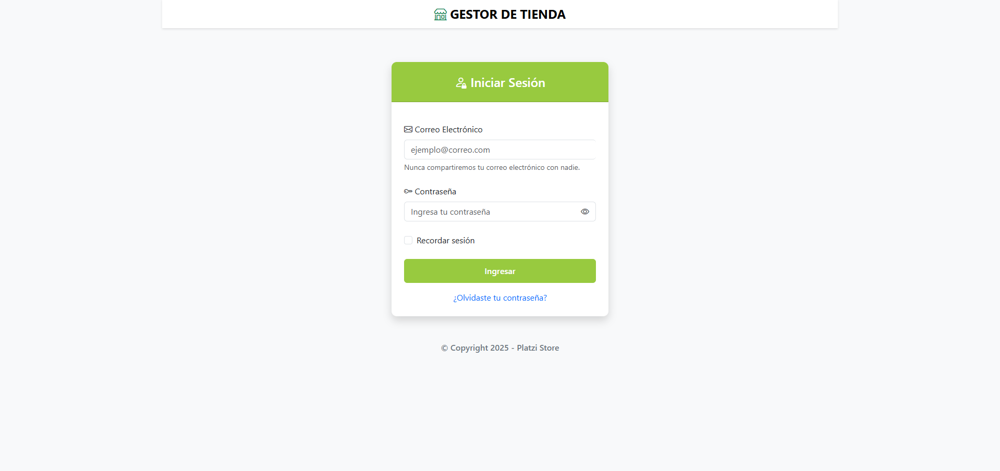
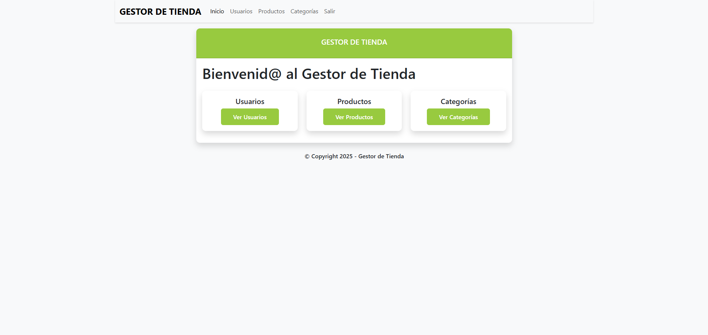
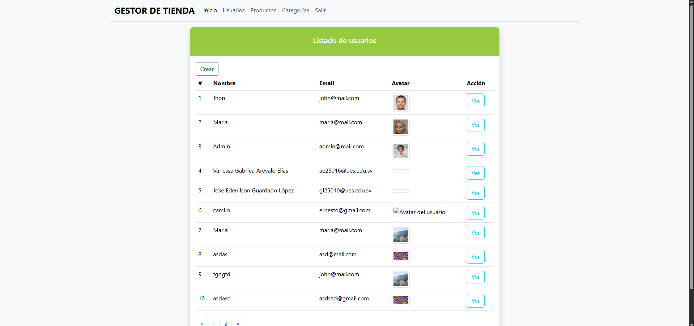
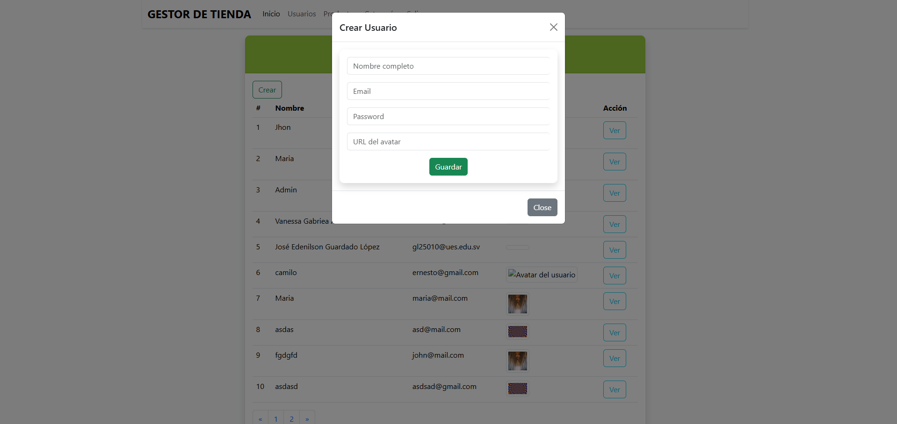
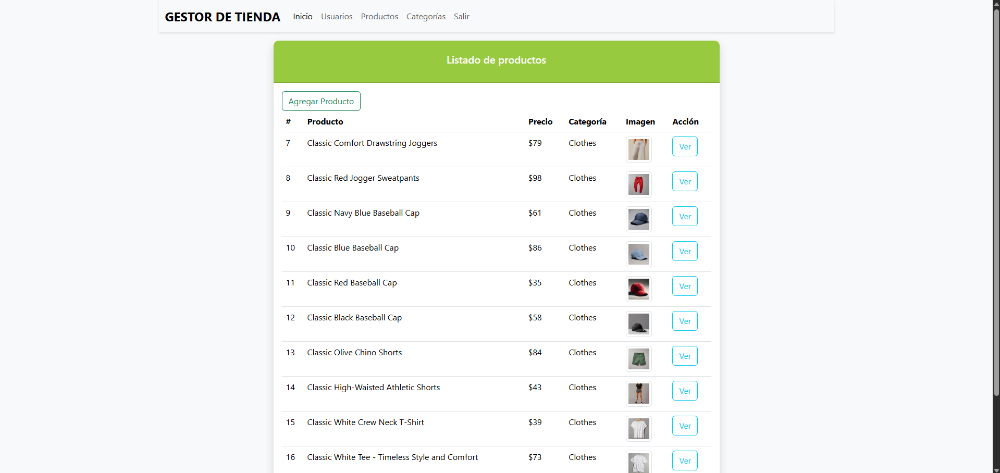
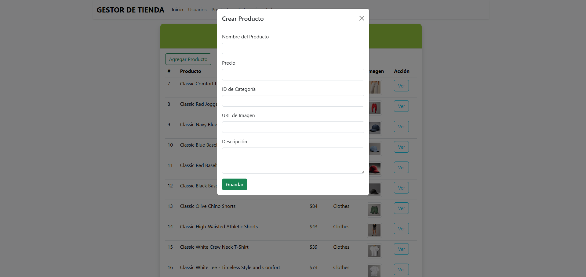
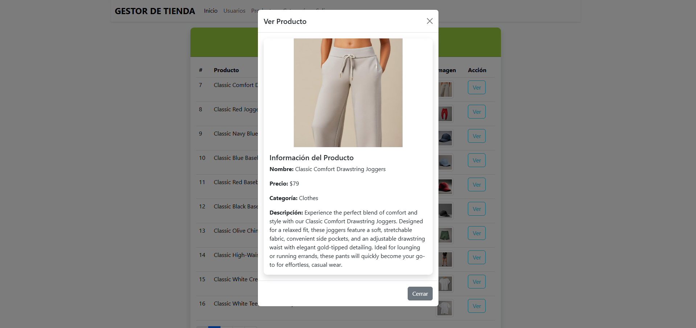
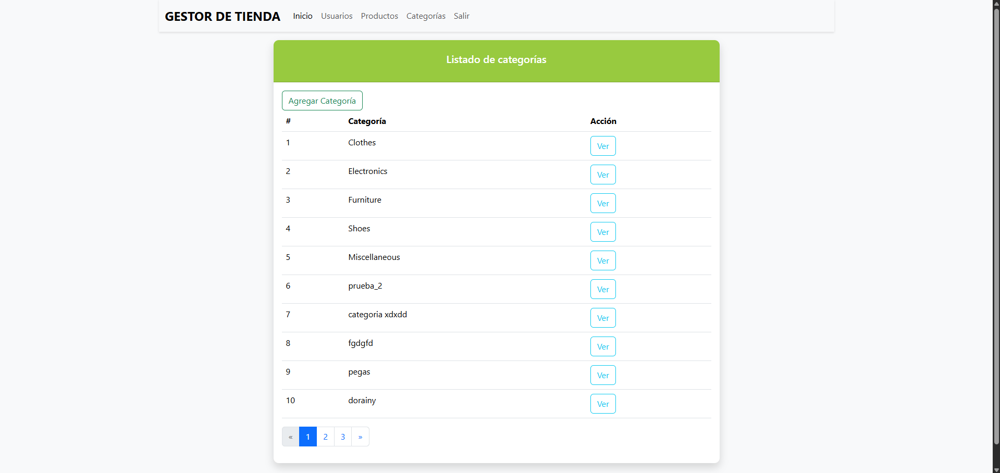
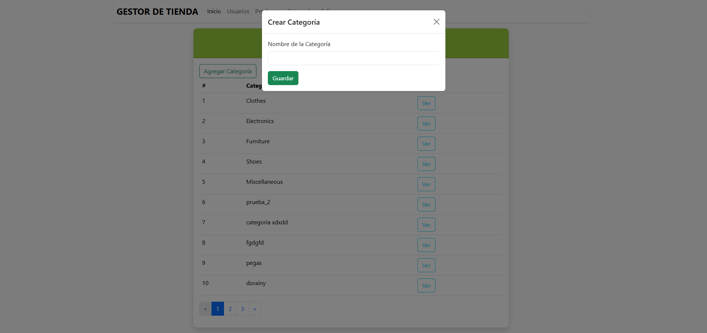
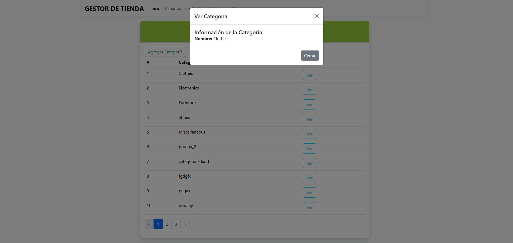

# shopping-category-front-examen
# Examen Final
Este proyecto es un aplicación web construida con html, bootstrap y con una API publica de platzi, incluye:
- **Login** (Inicio de sesion)
- **Dashboard** (Pantalla donde esta usuario, productos y cerrar sesión)
- **Usuarios** (Acá encontraremos todos los usuarios de la API)
- **Productos** (Al igual que con los usuarios, acá encontraremos todos los productos de la API)
- **Categorias** (Acá encontraremos las diferentes categorias de la API)
# Desarrolladores:
**Juan Sebastián López** - 192061
**Marco Estivens Castellanos** - 192059

# Capturas

